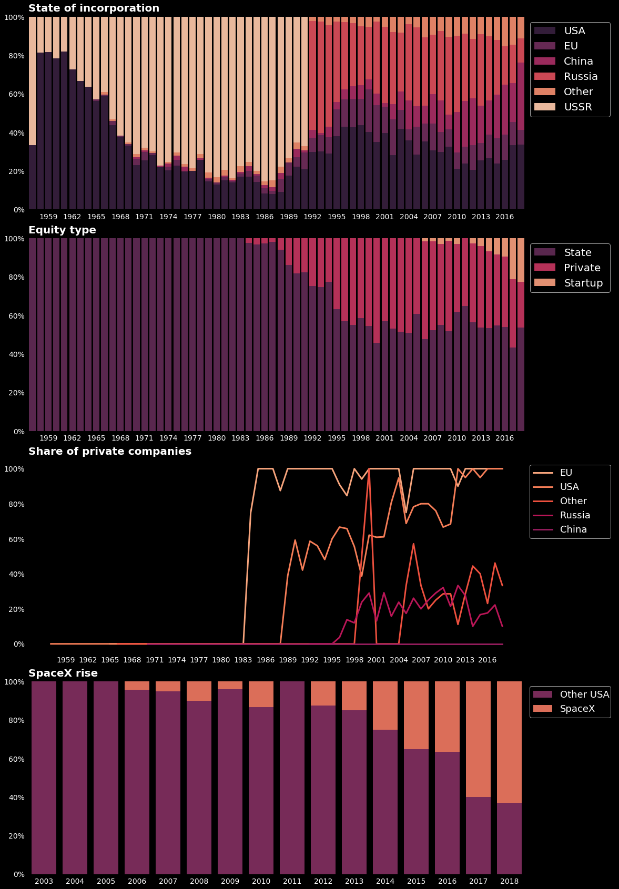

# Final project

## Space launches data

I've found a great dataset about space launches from 1967 until nowdays. It has some interesting properties such as state of incorporation of the company, which organized the launch, and it's eqity type. I want to explore how space launches market had evolved through time. Also, it's interesting to see how big is SapceX right now comapred to other companies.

### Explanation

I didn't want to create any complicated visulizations, because for me it was more important to show the evolution of the market and SpaceX's place in it. So the final visualization consists from four plots:
* Share of each "space" country in the global market
* Structure of ownership in the global market
* Share of private equity companies by country
* SapceX growth and it's share in the US market

### Conclusions

I want to draw a few conclusions based on those visualizations:
* USA is a constant dominant player in the market. Especially, they gained a big sahre after USSR colapse in 1991. But in a recent years they are threatened by Chinese rising space industry.
* In 80-90s there were a rise of private space companies. And main drivers of such shift are EU and USA.
* SpaceX became one of the biggest players in the USA and global market. Now SpaceX is a driver of the private sector in space industry.
